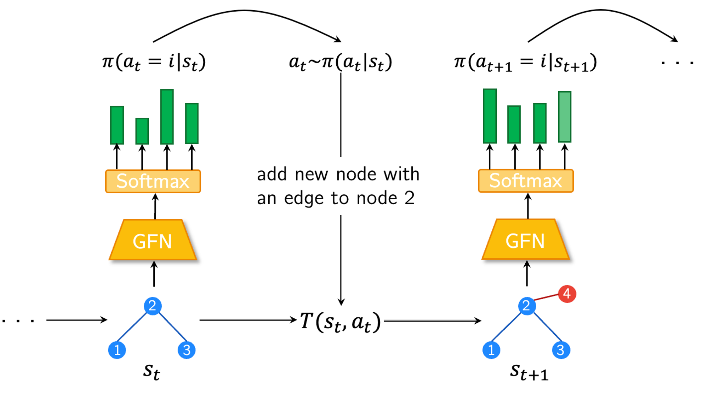

# `Alpha-gfn`: Mining formulaic alpha factors with generative flow networks

In this repo, we build an demo application that leverages a deep reinforcement learning framework to mine formulaic alpha factors using generative flow network models (i.e., GFlowNet). We give a brief introduction on the fundamental components of the project by answering the following questions. 

### What are formulaic alpha factors and why search for them?

In quantitative investment, formulaic alpha factors are mathematical expressions or formulas used to identify and potentially exploit patterns or signals in financial data, for example, US stocks in this demo. These factors are typically derived from historical market data and are used to generate investment signals for trading strategies. Here are some common characteristics of formulaic alpha factors:

1. **Quantitative Formulation:** Alpha factors are expressed mathematically as formulas or algorithms that calculate a numerical value based on input feature data, such as stock prices, trading volumes, financial ratios, or other market indicators.
1. **Signal Generation:** Alpha factors are designed to capture signals or patterns in market data that are believed to be predictive of future price movements or other market dynamics. These signals may indicate opportunities for buying, selling, or holding securities.
1. **Backtesting and Validation:** Formulaic alpha factors are typically tested and validated using historical data to assess their effectiveness in generating positive returns or outperforming the market.
1. **Integration into Trading Strategies:** Alpha factors are often integrated into quantitative trading strategies, where they serve as inputs for decision-making processes, such as portfolio construction, position sizing, risk management, and trade execution.

**In this project, we hope to develop an algorithm that generates assorted alpha factors that performs well in predicting the stock trend. In the most ideal case, they shall provide inspirations to alpha factor researchers or even be part of the trading strategies directly.**

We define an alpha factor $f$ as a function mapping feature vectors of all stocks on a trading day $X_t$ into alpha values $z_t = f(X_t)$. Examples of formulaic alpha factors include moving averages, momentum indicators, relative strength indexes, price-to-earnings ratios, and various technical and fundamental indicators, etc. However, in this demo, <ins>we only consider technical indicators and our search space consists of daily frequency market data only</ins>, such as open and close price (see details in [Methodology](#methodology)).

A common measure of effectiveness of an alpha factor is the (absolute) <ins>information correlation (IC)</ins> between the stock trend it aims to predict $y_t$ and the factor values $f(X_t)$, which is usually defined as the *Spearman correlation* of $y_t$ and $f(X_t)$.

### Basic components of reinforcement learning？

Following is a non-exaustive list of important concepts in reinforcement learning, which are used in the project and will be mentioned in the rest of this introduction.

1. **Agent**: The learner or decision-maker that interacts with the environment. It takes actions and receives rewards based on its actions. In our case, it is the 'alpha generator' modeled by GFlowNet.
1. **Environment**: The external system with which the agent interacts. It receives actions from the agent and returns observations and rewards. In our case, it is the stock market.
1. **State**: A snapshot of the environment at a particular time. It contains all the relevant information necessary for decision-making. *The state at time $t$ is usually denoted as $s_t$.* In our case, it is the sequence of action tokens that forms the the mathematical expression of an alpha factor (see [State space](#state) for details). 
1. **Action**: A decision made by the agent that affects the state of the environment. The set of all possible actions is called the action space. *The action at time $t$ is usually denoted as $a_t$.* In our case, the action space consists of mathematical operators and market data features (see [Action space](#action) for details). 
1. **Reward**: A scalar feedback signal received by the agent from the environment. It indicates how good or bad the action taken by the agent was. *The reward of state $s_t$ is usually dnoted as $R(s_t)$.* In our case, it is defined as the square of information correlation (IC) penalized by the missing data proportion in the generated alpha factor (see [Reward](#reward) for details).  
1. **Policy**: The strategy or rule that the agent uses to select actions based on states. It defines the mapping from states to actions. *The probability function that describes the policy is usually denoted as $\pi(a_t|s_t)$.* (See [Policy](#policy) for details.)

### What are GFlowNet models?

A GFlowNet is a trained stochastic policy or generative model, trained such that it samples objects $x$ through a sequence of constructive steps (i.e., actions), with probability proportional to a reward function $R(x)$, where $R$ is a non-negative integrable function. After proper training sessions, a GFlowNet is expected to be able to sample a **diversity** of solutions $x$ that have a high value of $R(x)$. [[1]](references)

The word ‘flow’ in GFlowNet actually refers to unnormalized probabilities of an action given a state. The proposed approach views the probability assigned to an action given a state as the flow associated with a network whose nodes are states, and outgoing edges from that node are deterministic transitions driven by an action. The total flow into the network is the sum of the rewards in the terminal states (i.e., a partition function) and can be shown to be the flow at the root node (or start state). The proposed algorithm is inspired by Bellman updates and converges when the incoming and outgoing flow into and out of each state match. [[4]](references)

<figcaption>llustration of the flow network. Source: [1] </figcaption>

\
A neural net can be used to sample each of these forward-going constructive actions, one at a time. An object $x$ is done being constructed when a special "exit" action or a deterministic criterion of the state (e.g., $x$ has exactly $n$ elements) has been triggered, when we have reached a terminal state $x$, and after which we can get a reward $R(x)$.

PS: Reward can only be gained after reaching terminal state of a trajectory is the so-called *episodic setting* of RL.

<figcaption>The most basic component of a GFlowNet. Source: [1] </figcaption>

### Why GFlowNet?

GFlowNet is motivated by cases where **diversity** of the generated candidates is particularly important when the oracle is itself uncertain. An "oracle" typically refers to an idealized agent or system that has perfect knowledge of the environment and can provide optimal actions or solutions. Traditional reinforcement learning algorithms tries to generate the single highest-reward sequence of actions, while GFlowNet samples a distribution of trajectories whose probability is proportional to a given positive return or reward function. [4,5]

In the task of searching for formulaic alpha factors, not only the predictive performance of alpha factors are important, we also value the ability of **exploration** of the search algoithm due to the massive amount of stochasticity in stock markets. We may use IC as a metric of predictive performance but blindedly pursuing high absolue IC might cause overfitting and spurious correlation between the factors. Hence, GFlowNet is advantageous in our research problem where we want the sampled alpha factors are diversified.

## Dataset

To alleviate computational burden, we use historical market data of stocks in the S&P 500 index from Year 2018 to Year 2019 for training purpose in this demo. Features include:

- **Open** - opening price
- **High** - maximum price during the day
- **Low** - minimum price during the day
- **Close** - close price adjusted for splits
- **Volume** - the number of shares that changed hands during a given day

Data sources:
- The set of stock ticks in S&P500 is extracted from https://github.com/datasets/s-and-p-500-companies/blob/main/data/constituents.csv.
- The US stock market data is downloaded from https://www.kaggle.com/datasets/jacksoncrow/stock-market-dataset.

You may find the pre-processing steps in `notebooks/preprocess.ipynb`.

## Methodology 

Implementation of the methodology can be found in `src/` folder. An example training session and some simple analyses can be found in `notebooks/process.ipynb`.

### Action space 

### State space 

### Reward 

### Loss function

Several training objectives have already been proposed for GFlowNets, all aiming at constructing a neural net that outputs the flows and/or the transition probabilities of the forward policy such that they define a proper flow, that matches the desired flow through the terminal states $x$, i.e., $F(x)=R(x)$.

The amount of flow reaching to a *terminal state* should be proportional to the positive return or reward function, i.e., for a terminal state $x$:
$$\pi(x) \approx \frac{R(x)}{Z} = \frac{R(x)}{\sum_{x'\in\chi} R(x')} \propto R(x) $$

### Policy network 

## Future Work

## References: 

- **Scripts and websites:**

    1. The GFlowNet Tutorial: https://milayb.notion.site/The-GFlowNet-Tutorial-95434ef0e2d94c24aab90e69b30be9b3
    2. The smiley face tutorial in GFlowNet GitHub repo: https://github.com/GFNOrg/torchgfn/blob/master/tutorials/notebooks/intro_gfn_smiley.ipynb
    3. The AlphaGen framework: https://github.com/RL-MLDM/alphagen/tree/master

- **Publications:**

    4. Bengio, Emmanuel, et al. "Flow network based generative models for non-iterative diverse candidate generation." Advances in Neural Information Processing Systems 34 (2021): 27381-27394.
    5. Bengio, Yoshua, et al. "Gflownet foundations." Journal of Machine Learning Research 24.210 (2023): 1-55.
    6. Yu, Shuo, et al. "Generating Synergistic Formulaic Alpha Collections via Reinforcement Learning." Proceedings of the 29th ACM SIGKDD Conference on Knowledge Discovery and Data Mining. 2023.

- **Special thanks** to ChatGPT for helping to draft this README!!!